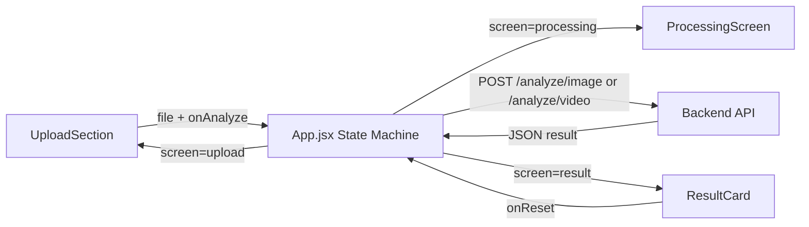

## Objective

Build the complete React frontend inside `frontend/` with a dark, cinematic forensic-tool aesthetic. Three screens (upload, processing, result) with smooth transitions, wired to the backend API endpoints.

---

## Design System

| Token | Value |
|-------|-------|
| Background | `#0d0f14` (deep charcoal) |
| Surface / Card | `rgba(255,255,255,0.03)` with subtle border `rgba(255,255,255,0.08)` + backdrop blur |
| Accent (cyan) | `#00e5ff` |
| Success (real) | `#00e676` (green) |
| Danger (fake) | `#ff3d00` (red/orange) |
| Primary text | `#ffffff` |
| Muted text | `#6b7280` |
| Heading font | Space Mono (monospace) |
| Body font | DM Sans (sans-serif) |
| Background texture | Subtle dot-grid pattern via CSS radial-gradient |

---

## Steps

### Step 1 — Scaffold Vite + React project

- Run `npm create vite@latest . -- --template react` inside `frontend/`
- Install deps: `npm install`
- Install fonts: `npm install @fontsource/space-mono @fontsource/dm-sans`
- Remove Vite boilerplate (`App.css`, default content in `App.jsx`, `assets/` contents)
- **Delete** `frontend/.gitkeep` (no longer needed)

### Step 2 — Global styles (`src/index.css`)

- **File:** `frontend/src/index.css`
- Reset/normalize basics (`margin: 0`, `box-sizing: border-box`)
- Set `body` background to `#0d0f14` with a subtle dot-grid pattern using `radial-gradient`
- Import `@fontsource/space-mono` and `@fontsource/dm-sans`
- Set default font to DM Sans, headings to Space Mono
- Define CSS custom properties for all design tokens (colors, fonts)
- Define `@keyframes fadeIn` and `@keyframes fadeOut` for screen transitions
- Define `@keyframes scanLine` for the processing animation
- Define `@keyframes barFill` for the confidence progress bar animation
- Glass-morphism card utility: dark bg, subtle border, `backdrop-filter: blur(12px)`

### Step 3 — `UploadSection.jsx` + `UploadSection.module.css`

- **Files:** `frontend/src/components/UploadSection.jsx`, `frontend/src/components/UploadSection.module.css`
- **Props:** `onAnalyze(file)` callback
- **Behavior:**
  - Large drop zone with dashed border, animated with a gentle pulse (`@keyframes borderPulse`)
  - `onDragOver` / `onDrop` handlers + hidden `<input type="file">` triggered on click
  - Accept attribute: `.jpg,.jpeg,.png,.mp4,.mov`
  - On file select: validate extension client-side, show inline error for unsupported types
  - Show filename + type badge (`IMAGE` or `VIDEO` in small pill) when file selected
  - "Analyze Media" button — full width, cyan accent, glowing box-shadow on hover
  - Supported formats hint text below the button

### Step 4 — `ProcessingScreen.jsx` + `ProcessingScreen.module.css`

- **Files:** `frontend/src/components/ProcessingScreen.jsx`, `frontend/src/components/ProcessingScreen.module.css`
- **Props:** none (pure presentational)
- **Behavior:**
  - Centered layout with a scanning animation (horizontal bar sweeping vertically inside a bordered rectangle, like a document scanner)
  - "Analyzing media..." in Space Mono
  - "This may take a few seconds" in muted text below
  - All on dark background, animation via CSS keyframes only

### Step 5 — `ResultCard.jsx` + `ResultCard.module.css`

- **Files:** `frontend/src/components/ResultCard.jsx`, `frontend/src/components/ResultCard.module.css`
- **Props:** `result` object (`{ label, confidence, frames_analyzed? }`), `onReset()` callback
- **Behavior:**
  - Headline: "AUTHENTIC" (green) or "DEEPFAKE DETECTED" (red/orange), bold, large
  - Confidence: percentage number + horizontal bar that animates width on mount (using `barFill` keyframe)
  - Bar color matches verdict (green for real, red for fake)
  - If `frames_analyzed` is present, show "X frames analyzed" line
  - Disclaimer in small muted text at bottom
  - "Analyze Another File" button resets via `onReset()`

### Step 6 — `App.jsx` (root component)

- **File:** `frontend/src/App.jsx`
- **State:** `screen` (`"upload"` | `"processing"` | `"result"`), `result` (null or API response), `error` (null or string)
- **Flow:**
  1. `upload` screen renders `<UploadSection onAnalyze={handleAnalyze} />`
  2. `handleAnalyze(file)`:
     - Determine endpoint from file extension (`.jpg`/`.jpeg`/`.png` -> `/analyze/image`, `.mp4`/`.mov` -> `/analyze/video`)
     - Set screen to `"processing"`
     - POST to endpoint with `FormData` (key: `file`)
     - On success: store result, set screen to `"result"`
     - On error: set error message, return to `"upload"` screen
  3. `result` screen renders `<ResultCard result={result} onReset={handleReset} />`
  4. `handleReset()`: clear result, set screen to `"upload"`
- Wrap screen content in a div with `fadeIn` CSS animation class for transitions
- Show error toast/banner if API call fails

### Step 7 — `main.jsx` entry point

- **File:** `frontend/src/main.jsx`
- Import `@fontsource/space-mono` and `@fontsource/dm-sans`
- Import `./index.css`
- Render `<App />` into `#root`

---

## File Summary (new/modified)

| # | File | Action |
|---|------|--------|
| 1 | `frontend/` (Vite scaffold) | Generated by `npm create vite` |
| 2 | `frontend/src/index.css` | Rewrite with design system |
| 3 | `frontend/src/components/UploadSection.jsx` | New |
| 4 | `frontend/src/components/UploadSection.module.css` | New |
| 5 | `frontend/src/components/ProcessingScreen.jsx` | New |
| 6 | `frontend/src/components/ProcessingScreen.module.css` | New |
| 7 | `frontend/src/components/ResultCard.jsx` | New |
| 8 | `frontend/src/components/ResultCard.module.css` | New |
| 9 | `frontend/src/App.jsx` | Rewrite |
| 10 | `frontend/src/main.jsx` | Rewrite |
| 11 | `frontend/.gitkeep` | Delete |

---

## Architecture Flow

---

## Constraints

- No backend file changes
- Plain CSS modules for component-level styles + global `index.css` for tokens/animations
- No Tailwind, no UI library
- Font packages: `@fontsource/space-mono`, `@fontsource/dm-sans`
- The `frontend-design` skill will be used during implementation for high design quality

---

## Verification / Definition of Done

| Check | How |
|-------|-----|
| Vite dev server starts | `npm run dev` in `frontend/` serves on `:5173` without errors |
| Upload screen renders | Drop zone visible, file selection works, extension validation works |
| Processing screen renders | Scan animation plays on screen transition |
| Result screen renders | Correct label/color, animated confidence bar, frames count for video |
| Screen transitions | Fade animation between all three states |
| API integration | File is POSTed correctly, response parsed and displayed |
| Error handling | Invalid file type shows inline error; API failure shows error message |

---

## Step-to-Target Traceability

| Step | Targets | Verification |
|------|---------|-------------|
| 1 | Vite scaffold | `npm run dev` starts clean |
| 2 | `index.css` | Dark bg, dot-grid, CSS variables, animations defined |
| 3 | `UploadSection.*` | Drag-drop, click-browse, validation, file badge, CTA button |
| 4 | `ProcessingScreen.*` | Scan animation, centered text, dark aesthetic |
| 5 | `ResultCard.*` | Verdict headline, animated bar, frames count, disclaimer, reset |
| 6 | `App.jsx` | State machine, API calls, transitions, error handling |
| 7 | `main.jsx` | Font imports, CSS import, renders App |
